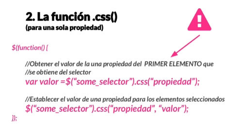
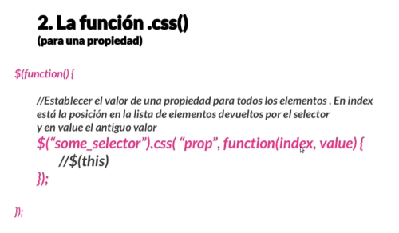
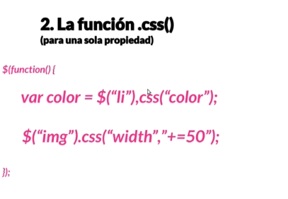
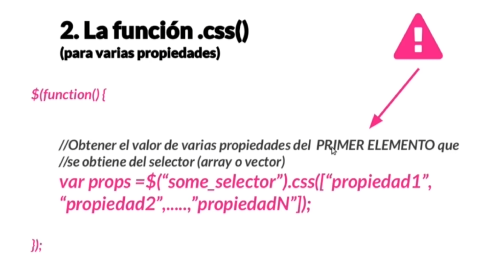
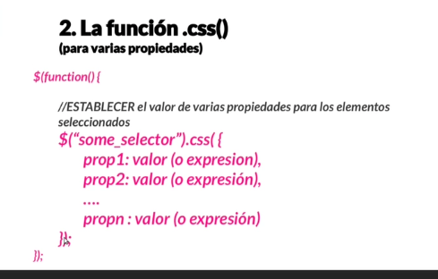
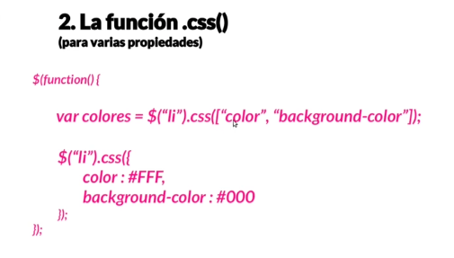

# Introducción a jQuery
jQuery es una biblioteca de javascript que simplifica el manejo del DOM (Document Object Model), el manejo de eventos, animaciones, y las peticiones AJAX. Usar jQuery ayuda a escribir código más conciso y compatible entre diferentes navegadores.

## Sintaxis Básica de jQuery
La sintaxis básica es: $(selector).acción()
$ es el símbolo de jQuery.
(selector) selecciona elementos en el DOM.
.acción() aplica una acción o efecto en el elemento seleccionado.

### Ejecución de jQuery cuando el documento esté listo
Para asegurarse de que jQuery se ejecute después de que la página esté cargada, usamos:
```javascript
$(document).ready(function() {
    // Código jQuery aquí
});
```

## Selectores Básicos
* $("h1") - Selecciona todos los elementos <h1>
* $("#id") - Selecciona un elemento por su ID.
* $(".class") - Selecciona todos los elementos con una clase específica.

## Manipulación de Estilos CSS
Cambiar el estilo de un elemento:
```javascript
$("p").css("background-color", "red");
$("#segundo").css("color", "blue");
```

### Mostrar y Ocultar Elementos
* .hide() - Oculta el elemento seleccionado.
* .show() - Muestra el elemento oculto.
Ejemplo:
```javascript
$("#btn-hide").click(function() {
    $(".tercero").hide();
});
$("#btn-show").click(function() {
    $(".tercero").show();
});
```

## Eventos del Mouse
* .click() - Ejecuta una función al hacer clic.
* .dblclick() - Ejecuta una función al hacer doble clic.
* .mouseenter() - Ejecuta una función al pasar el mouse sobre el elemento.
* .mouseleave() - Ejecuta una función al retirar el mouse del elemento.
Ejemplo:
```javascript
$(".primero").mouseenter(function() {
    $("#segundo").fadeOut(); // Desaparece lentamente
});
$(".primero").mouseleave(function() {
    $("#segundo").fadeIn(); // Aparece nuevamente
});
```

## Animaciones Básicas
* .fadeOut() y .fadeIn() - Efecto de desvanecimiento.
* .slideDown() y .slideUp() - Despliega o repliega un elemento.

## Manipulación del Contenido de Texto y HTML
* .text() - Obtiene o establece el texto de un elemento.
* .html() - Obtiene o establece el contenido HTML de un elemento.
* .attr() - Obtiene o cambia el valor de un atributo.
Ejemplo:
```javascript
// Obtener el texto o HTML de un elemento
alert($("#segundo").text());
alert($("#segundo").html());
  
// Cambiar el texto, HTML o atributo de un elemento
$("#btn-4").click(function() {
    $("#segundo").text("Nuevo texto");
});
$("#btn-5").click(function() {
    $("#segundo").html("Nuevo <strong>html</strong>");
});
$("#btn-6").click(function() {
    $("#segundo").attr("title", "Nuevo título");
});
```

## Añadir o Eliminar Contenido
* .append() - Añade contenido al final de un elemento.
* .prepend() - Añade contenido al principio de un elemento.
* .after() - Inserta contenido después de un elemento.
* .before() - Inserta contenido antes de un elemento.
Ejemplo:
```javascript
$("#btn-7").click(function() {
    $("#segundo").append(" Texto al final");
});
$("#btn-8").click(function() {
    $("#segundo").prepend(" Texto al principio");
});
$("#btn-9").click(function() {
    $("#segundo").after("<p>Texto después del párrafo</p>");
    $("#segundo").before("<p>Texto antes del párrafo</p>");
});
```

## Eliminar o Vaciar Elementos
* .remove() - Elimina el elemento seleccionado.
* .empty() - Vacía el contenido interno del elemento seleccionado.
Ejemplo:
```javascript
$("#btn-10").click(function() {
    $("#segundo").remove(); // Elimina el elemento con ID "segundo"
    $(".primero").empty(); // Vacía el contenido del elemento con clase "primero"
});
```

## Manejo de Clases CSS
* .addClass() - Añade una clase CSS a un elemento.
* .removeClass() - Elimina una clase CSS de un elemento.
* .toggleClass() - Añade o elimina una clase CSS dependiendo de si ya está presente.
Ejemplo:
```javascript
$("#btn-11").click(function() {
    $("h1").addClass("red"); // Añade clase "red" a todos los h1
});
$("#btn-12").click(function() {
    $("h1").removeClass("red"); // Elimina clase "red" de todos los h1
});
$("#btn-13").click(function() {
    $("h2").toggleClass("blue"); // Alterna la clase "blue" en h2
});
```

## Resumen de Métodos de jQuery Vistos
| Método | Descripción |
| --- | --- |
| .hide(), .show() | Oculta o muestra elementos |
| .fadeIn(), .fadeOut() | Efecto de desvanecimiento |
| .slideDown(), .slideUp() | Despliega o repliega un elemento |
| .text() | Obtiene o establece el texto |
| .html() | Obtiene o establece el contenido HTML |
| .attr() | Obtiene o cambia el valor de un atributo |
| .append(), .prepend() | Añade contenido al final o inicio |
| .before(), .after() | Inserta contenido antes o después |
| .remove(), .empty() | Elimina o vacía el contenido |
| .addClass(), .removeClass(), .toggleClass() | Manipulación de clases CSS |


## Selectores Básicos
* $("h1") - Selecciona todos los elementos <h1>
* $("#id") - Selecciona un elemento por su ID.
* $(".class") - Selecciona todos los elementos con una clase específica.

## Manipulación de Estilos CSS
Cambiar el estilo de un elemento:
```javascript
$("p").css("background-color", "red");
$("#segundo").css("color", "blue");
```

### Mostrar y Ocultar Elementos
* .hide() - Oculta el elemento seleccionado.
* .show() - Muestra el elemento oculto.
Ejemplo:
```javascript
$("#btn-hide").click(function() {
    $(".tercero").hide();
});
$("#btn-show").click(function() {
    $(".tercero").show();
});
```

## Eventos del Mouse
* .click() - Ejecuta una función al hacer clic.
* .dblclick() - Ejecuta una función al hacer doble clic.
* .mouseenter() - Ejecuta una función al pasar el mouse sobre el elemento.
* .mouseleave() - Ejecuta una función al retirar el mouse del elemento.
Ejemplo:
```javascript
$(".primero").mouseenter(function() {
    $("#segundo").fadeOut(); // Desaparece lentamente
});
$(".primero").mouseleave(function() {
    $("#segundo").fadeIn(); // Aparece nuevamente
});
```

## Animaciones Básicas
* .fadeOut() y .fadeIn() - Efecto de desvanecimiento.
* .slideDown() y .slideUp() - Despliega o repliega un elemento.

## Manipulación del Contenido de Texto y HTML
* .text() - Obtiene o establece el texto de un elemento.
* .html() - Obtiene o establece el contenido HTML de un elemento.
* .attr() - Obtiene o cambia el valor de un atributo.
Ejemplo:
```javascript
// Obtener el texto o HTML de un elemento
alert($("#segundo").text());
alert($("#segundo").html());
  
// Cambiar el texto, HTML o atributo de un elemento
$("#btn-4").click(function() {
    $("#segundo").text("Nuevo texto");
});
$("#btn-5").click(function() {
    $("#segundo").html("Nuevo <strong>html</strong>");
});
$("#btn-6").click(function() {
    $("#segundo").attr("title", "Nuevo título");
});
```

## Añadir o Eliminar Contenido
* .append() - Añade contenido al final de un elemento.
* .prepend() - Añade contenido al principio de un elemento.
* .after() - Inserta contenido después de un elemento.
* .before() - Inserta contenido antes de un elemento.
Ejemplo:
```javascript
$("#btn-7").click(function() {
    $("#segundo").append(" Texto al final");
});
$("#btn-8").click(function() {
    $("#segundo").prepend(" Texto al principio");
});
$("#btn-9").click(function() {
    $("#segundo").after("<p>Texto después del párrafo</p>");
    $("#segundo").before("<p>Texto antes del párrafo</p>");
});
```

## Eliminar o Vaciar Elementos
* .remove() - Elimina el elemento seleccionado.
* .empty() - Vacía el contenido interno del elemento seleccionado.
Ejemplo:
```javascript
$("#btn-10").click(function() {
    $("#segundo").remove(); // Elimina el elemento con ID "segundo"
    $(".primero").empty(); // Vacía el contenido del elemento con clase "primero"
});
```

## Manejo de Clases CSS
* .addClass() - Añade una clase CSS a un elemento.
* .removeClass() - Elimina una clase CSS de un elemento.
* .toggleClass() - Añade o elimina una clase CSS dependiendo de si ya está presente.
Ejemplo:
```javascript
$("#btn-11").click(function() {
    $("h1").addClass("red"); // Añade clase "red" a todos los h1
});
$("#btn-12").click(function() {
    $("h1").removeClass("red"); // Elimina clase "red" de todos los h1
});
$("#btn-13").click(function() {
    $("h2").toggleClass("blue"); // Alterna la clase "blue" en h2
});
```


1. Selección de Elementos
Ocultar elementos específicos
```javascript

$("h1, h2, h3").hide();               // Oculta todos los h1, h2, h3
$("input[type='password']").hide();    // Oculta todos los inputs de tipo password
$("img").eq(1).hide();                 // Oculta la segunda imagen
```
Pseudoelementos
```javascript

$("ul.icons li:first-child").hide();   // Oculta el primer li de la lista con clase icons
$("ul.icons li:last-child").hide();    // Oculta el último li
$("ul.icons li:nth-child(2)").hide();  // Oculta el segundo li
$("td:last-of-type").hide();           // Oculta el último td de cada fila
$("input:required").hide();            // Oculta los inputs requeridos
$("input:disabled").hide();            // Oculta los inputs deshabilitados
```
Selectores específicos
```javascript

$("img").eq(0).hide();                 // Oculta la primera imagen
$("form").has("input[type='password']").hide(); // Oculta los formularios con un campo password
$("tbody td:contains('a')").eq(0).hide(); // Oculta el primer td que contiene 'a'
```
Filas pares e impares
```javascript

$("tbody tr:odd").hide();              // Oculta las filas impares
$("tbody tr:even").hide();             // Oculta las filas pares
$(":input").hide();                    // Oculta todos los elementos de formulario
Rangos de elementos seleccionados
```javascript

$("img:gt(3)").hide();                 // Oculta las imágenes después del índice 3
$("img:lt(3)").hide();                 // Oculta las imágenes antes del índice 3
$("img").last().hide();                // Oculta la última imagen
$("img").first().hide();               // Oculta la primera imagen
```
Selección por tipo de elemento

```javascript

$(":password").hide();                 // Oculta los campos de contraseña
$(":text").hide();                     // Oculta los campos de texto
$(":header").css("color", "red");      // Aplica color rojo a todos los encabezados
$("tr:parent").hide();                 // Oculta las filas que tienen hijos
$("img:hidden").show();                // Muestra las imágenes ocultas
$("img:visible").hide();               // Oculta las imágenes visibles
```
2. Iteración y this
.each() y this
```javascript

$("img").each(function(index) {
    $(this).css("background-color", "red"); // Cambia el fondo de cada imagen a rojo
});

$("li").each(function(index) {
   console.log(`El elemento ${index} contiene ${$(this).text()}`);
   if (index % 2 == 0){
       $(this).css("background-color", "red"); 
   }
});
```
3. Ejercicios de Selección
```javascript

$("td:contains('b')").css("color", "red");         // Colorea de rojo los td que contienen 'b'
$("td:nth-child(1):contains('b')").text("HOLA");   // Cambia el texto de los td en la primera columna que contienen 'b'
$(":input").hide();                                // Oculta todos los campos y botones del formulario
$("form span").hide();                             // Oculta todos los span en el formulario
$(":header").hide();                               // Oculta todos los encabezados
$("li:gt(1)").hide();                              // Oculta los elementos de la lista salvo el primero
$("img:eq(3), img:eq(4)").hide();                  // Oculta la tercera y cuarta imagen
```
4. Añadir y quitar estilos
Estilo individual
```javascript

$("img").eq(4).width("20px");         // Cambia ancho de la cuarta imagen a 20px
$("img").eq(4).height("20px");        // Cambia alto de la cuarta imagen a 20px
```
Aplicar a todos
```javascript

$("img").width("20px");               // Cambia el ancho de todas las imágenes
```
Obtener el valor de un estilo
```javascript

let size = $("img").width();          // Obtiene el ancho de la primera imagen
```
Aplicación de múltiples estilos
```javascript

$("li").css({
    "color": "pink",
    "background-color": "blue"
});
5. Funciones para estilos: Clases
```javascript

$("tbody tr:first td:nth-child(2)").addClass("celda-destacada");
$("tbody tr:first").removeClass("celda-destacada");
```
Añadir o quitar clase según función
```javascript

$("section").addClass(function(index){
    return "section-" + index;
});

$("section").removeClass(function(index){
    return "section-" + index;
});
```
.toggleClass() y .hasClass()

```javascript

$("tbody tr:first").toggleClass("celda-destacada"); // Alterna la clase
if ($("td").hasClass("celda-destacada")) {
    alert("Hay celdas destacadas");
}
```
6. Manipulación de atributos
.attr() y .prop()
```javascript

$("a").attr("target", "_blank");                // Todos los enlaces se abren en nueva ventana
$("#miperfil").attr({"alt": "mi perfil", "title": "mi perfil"}); // Dos atributos
$("img").attr("src", "imagenPrueba.jpg");       // Cambia src de todas las imágenes
$("input").removeAttr("required");              // Elimina el atributo required de todos los inputs
```
.prop() ejemplo
```javascript

$("a").prop("target", "_blank");                // Cambia propiedad target
$("#miperfil").prop({"alt": "mi perfil", "title": "mi perfil"}); // Cambia dos propiedades
$("input").removeProp("required");              // Elimina la propiedad required de los inputs
```
7. Modificar el árbol de HTML
Vaciar, obtener y fijar contenido HTML
```javascript

$(".card").last().empty();                      // Vacía el último elemento con clase .card
var lista = $("ul").html();                     // Obtiene el HTML de la lista
$(".iconized").html(function(index, oldtext) {
    return `${oldtext} <li>Nuevo elemento</li>`;
});
$(".iconized").text(function(index, oldtext) {
    return `${oldtext} <li>Nuevo elemento</li>`;
});
```
Añadir o quitar contenido
```javascript

$(".card").last().wrap("<section></section>");  // Envuelve el último .card en un section
$(".card").last().wrapAll("<section></section>"); // Envuelve todos los .card juntos en un section
$(".card").last().unwrap();                     // Quita el contenedor de un .card
$("section").last().wrapInner("<div class='card'></div>"); // Inserta un div en el último section
```
8. .val() para manipulación de valores
Obtener y fijar valor de input
```javascript

$("input").val("Pepe");                         // Cambia el valor del primer input a "Pepe"
var nombre = $("input").eq(0).val(function(index, valor){
    return valor + " Pepe";
});
```
Ejemplo con append()
```javascript

for (i = 0; i < 10; i++) {
    $("tbody").append(`<tr><td>${i}</td><td>${i}</td></tr>`);
}
```







